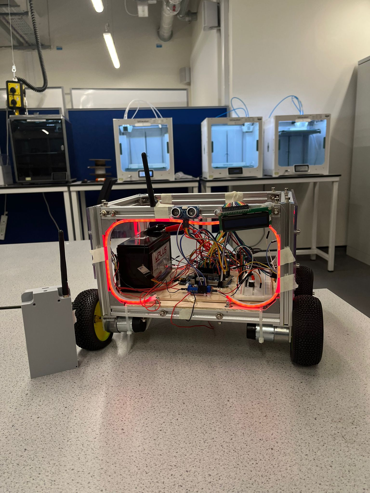
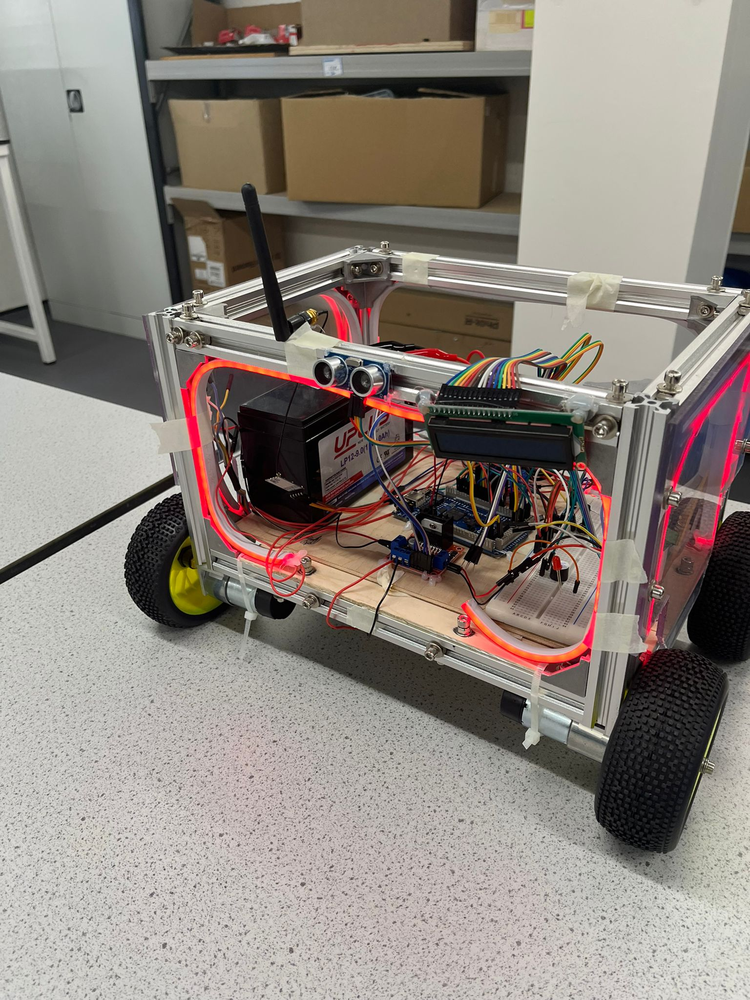
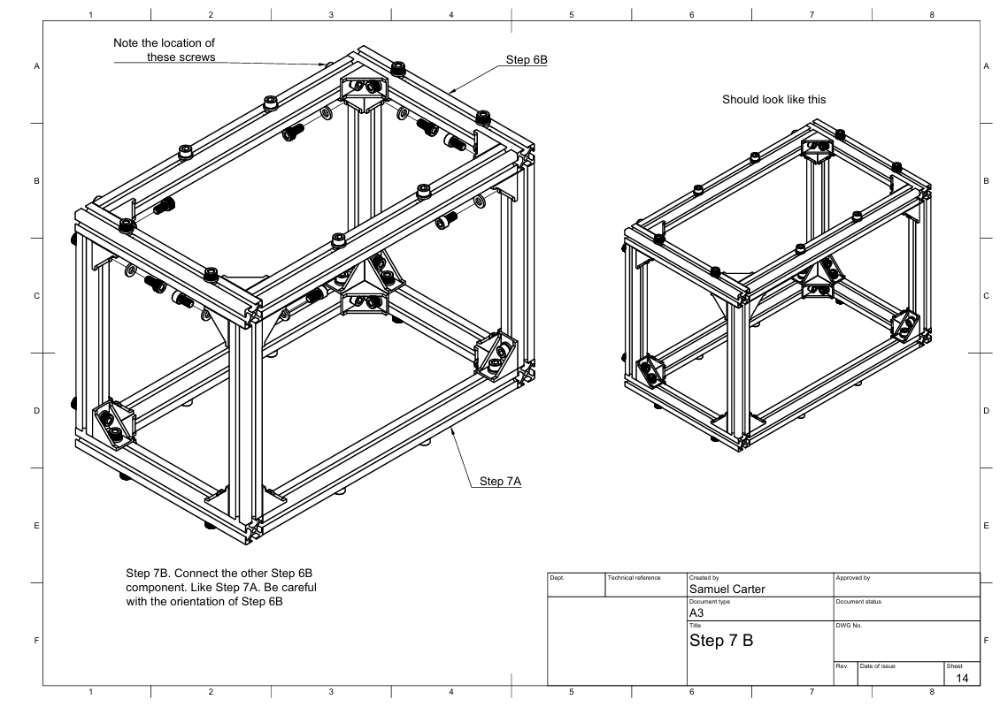
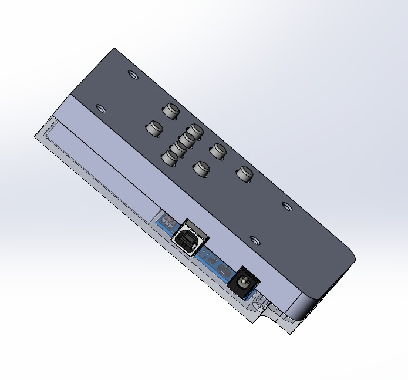

# OpenScout v1.2


OpenScout v1.2 presents an enhanced implementation of the OpenScout mobile robot platform, featuring a novel multi-modal control architecture that integrates conventional wireless control with ROS 2 infrastructure. The system employs a dual-microcontroller architecture utilizing Arduino GIGA R1 WiFi and Arduino Uno, providing three independent control interfaces: HC-12 long-range wireless keypad (100m range),
USB serial interface, and ROS 2 integration via TCP/JSON bridge. A
key innovation is the implementation of a lightweight TCP server on the
Arduino GIGA that enables ROS 2 Twist message compatibility without requiring ros_serial, addressing the compatibility gap in ROS 2 for
resource-constrained embedded systems. The platform incorporates realtime obstacle detection using four ultrasonic sensors with 50cm threshold triggering and buzzer warning with automatic motion prevention.
FreeRTOS task scheduling enables concurrent execution of motor control, network communication, and sensor processing. Quantitative evaluation demonstrates successful multi-modal operation with network latency under 100ms and reliable obstacle detection. This work provides a
reproducible, open-source educational platform bridging embedded systems and modern robotics middleware, licensed under CERN-OHL-S2.0, with complete build documentation enabling 6–20 hour assembly by
non-specialists.

| | |
|--|--|
|  |  |
---


## Table of Contents

1. [General Info](#1-general-info)
2. [Build Materials](#2-build-materials)
3. [Mechanical Assembly](#3-mechanical-assembly)
4. [Electric Circuit & Firmware](#4-electric-circuit--firmware)
5. [Testing](#5-testing)
6. [Contributors](#6-contributors) 
7. [Demonstration Video](#7-demonstration-video) 

### 1. General Info 

I. OpenScout V2 & ROS 2 Integration


OpenScout V2 is an enhanced mobile robot platform designed to bridge embedded systems and ROS 2 for accessible robotics education. The system integrates low-level microcontroller-based control with high-level Robot Operating System 2 (ROS 2) infrastructure, enabling both manual and autonomous operation. The platform emphasizes modularity, low cost, and compatibility with resource-constrained embedded hardware.

The robot employs a dual-microcontroller architecture consisting of an Arduino GIGA R1 WiFi and an Arduino Uno. This architecture allows separation of concerns between real-time motor control, sensor processing, and high-level communication with ROS 2. OpenScout V2 supports multiple control interfaces, including wireless, USB serial, and ROS 2-based control.

II. Software Description

OpenScout V2 uses a hybrid software stack combining embedded firmware and ROS 2 middleware. ROS 2 serves as the high-level communication and control framework, while the microcontrollers handle low-level actuation and sensing tasks. ROS 2 operates as a distributed middleware system based on publish–subscribe communication. Motion commands are transmitted as standard ROS 2 messages over a TCP/IP network, allowing seamless integration with existing ROS 2 tools and algorithms. A key design contribution of OpenScout V2 is the implementation of a lightweight TCP/JSON bridge, enabling ROS 2 communication without relying on ros_serial, which is not fully compatible with ROS 2 on constrained embedded platforms.

a). Motion Control

OpenScout V2 is a differential-drive mobile robot. High-level motion commands are expressed using the standard ROS 2 Twist message type, which includes linear and angular velocity components.The Arduino GIGA R1 WiFi hosts a custom TCP server that receives serialized Twist commands from ROS 2 and converts them into motor control signals. These commands are forwarded to the Arduino Uno, which directly controls the motor drivers. This separation ensures real-time responsiveness while maintaining ROS 2 compatibility.

b). Teleoperation Modes

The platform supports multiple manual control modes:

* Wireless keypad control using an HC-12 long-range wireless module (up to 100 m range)

* USB serial control for direct wired operation

* ROS 2 teleoperation, where motion commands are generated from standard ROS 2 tools

>> These interfaces operate independently, enabling flexible switching between control modes for testing, education, and deployment.

c). Sensors and Obstacle Detection

OpenScout V2 is equipped with four ultrasonic distance sensors mounted around the robot chassis. These sensors provide real-time obstacle detection with a configurable threshold (default set to 50 cm).

When an obstacle is detected within the threshold:

* A buzzer warning is triggered

* Robot motion is automatically inhibited to prevent collisions

>>Sensor processing is handled locally on the microcontroller to ensure fast response times independent of ROS 2 network latency.

d). Real-Time Embedded Scheduling

The embedded software stack uses FreeRTOS to manage concurrent tasks on the Arduino GIGA R1 WiFi. Separate tasks are assigned for:

* Motor control

* Network communication (TCP server)

* Sensor acquisition and obstacle detection

>>This task-based scheduling ensures reliable real-time performance and prevents blocking behavior during communication or sensing operations.

e). ROS 2 Communication Interface

Instead of using ros_serial, OpenScout V2 implements a custom TCP-based communication layer. The Arduino GIGA R1 WiFi runs a lightweight TCP server that:

* Receives ROS 2 Twist messages encoded in JSON

* Decodes and validates incoming commands

* Forwards control signals to the motor controller

>>This approach reduces system complexity and improves compatibility with ROS 2, while maintaining low communication latency (measured under 100 ms in evaluation).

---
---
### 2. Build Materials


| Material/Components                         | Quantity | Reference/Description | Link |
| -------------------------------- | -------- | --------- | ------- |
| 300 mm 20×20 Aluminium Extrusion | 4        | A1        | [Link](https://ooznest.co.uk/product/v-slot-linear-rail-20x20mm-cut-to-size/)    |
| 200 mm 20×20 Aluminium Extrusion | 8        | A2        | [Link](https://ooznest.co.uk/product/v-slot-linear-rail-20x20mm-cut-to-size/)    |
| 20×20 Angle Joint Brackets       | 16       | B1        | [Link](https://amz.run/5TF6)    |
| 90° Cast Corner Brackets         | 8        | B2        | [Link](https://ooznest.co.uk/product/90-degree-cast-corner/)    |
| M5 × 12 mm Hex Socket Screws     | 72       | S5.12     | –       |
| M4 T-Slot Nuts                   | 8        | T4        | –       |
| M5 T-Slot Nuts                   | 72       | T5        | –       |
| M5 Washers                       | 80       | N3        | –       |
| Arduino GIGA R1 WiFi | 1 | Main robot controller (receiver) | [Link](https://www.amazon.co.uk/Arduino-Giga-R1-WiFi-ABX00063/dp/B0BTTRZ9TB/ref=sr_1_1?crid=3CUDI4LWKEYXL&dib=eyJ2IjoiMSJ9.IP0WBIchH9_H_AWopRbUy5tJHdcN9b5qJTUo9A1J4a7Z1TXuW153tPPnkJcK8wH-wdNYFYROX4M6tkqHzxIvPFl7QhENgdiTh2oGX5lrLpvdM-g-cOMt2ZLjqEPfUTsZu8BPCRhzvdQHNyAtj_1jxSf-CW57lHjZuuxKpnFdh1r8axagfsoIrZ05k9rZvUemWuNAruoBKb4NZvrALEmj-bvCs2JYuvxKoiCDYFxdL0I.UcCpw1lzWSEngtHXgSbNdwzM0BjD29KGi_5cd4B5CCU&dib_tag=se&keywords=arduino+giga+r1&qid=1770740029&sprefix=arduino+giga+r1%2Caps%2C101&sr=8-1) |
| Arduino Uno | 1 | Remote controller (transmitter) | [Link](https://www.amazon.co.uk/Arduino-A000066-ARDUINO-UNO-REV3/dp/B008GRTSV6/ref=sxin_15_pa_sp_search_thematic_sspa?content-id=amzn1.sym.d44aa7b9-1d41-415b-8c81-0edf7a62bd7d%3Aamzn1.sym.d44aa7b9-1d41-415b-8c81-0edf7a62bd7d&crid=2BNESW9LRVD3N&cv_ct_cx=arduino+uno&keywords=arduino+uno&pd_rd_i=B008GRTSV6&pd_rd_r=98d2a6ec-dca4-4c47-a947-c4b5ba3026b0&pd_rd_w=OjsCG&pd_rd_wg=Olg0T&pf_rd_p=d44aa7b9-1d41-415b-8c81-0edf7a62bd7d&pf_rd_r=3W1G14N1M4636651QY6G&qid=1770736267&s=industrial&sbo=RZvfv%2F%2FHxDF%2BO5021pAnSA%3D%3D&sprefix=arduino+uno%2Cindustrial%2C72&sr=1-3-4ab648ba-44b3-436b-8ee5-705efb8a8e28-spons&aref=wwdbyGP993&sp_csd=d2lkZ2V0TmFtZT1zcF9zZWFyY2hfdGhlbWF0aWM&psc=1) |
| L298N Motor Driver | 2 | Dual H-bridge motor driver for DC motors | [Link](http://amazon.co.uk/CRGANGZY-Development-Electronic-Components-capacitor/dp/B0D6GWW7W6?source=ps-sl-shoppingads-lpcontext&ref_=fplfs&psc=1&smid=AZMZ38E5CSYOF) |
| DC Gear Motors | 4 | Left and right drive motors | [Link](https://www.amazon.co.uk/CQRobot-Ocean-6V-5W-60RPM-18-oz-12V-10W-120RPM-32/dp/B08ZK8RWK4/ref=sr_1_1?crid=2GFCW6HXE2NLT&keywords=90:1+cqrobot&qid=1649155021&sprefix=90+1+cqrobot,aps,78&sr=8-1&th=1) |
| 16×2 LCD Display | 1 | Displays IP address and system status | N/A |
| 10 kΩ Potentiometer | 1 | LCD contrast adjustment | N/A |
| HC-12 Wireless Module | 2 | Long-range serial wireless communication | [Link](https://www.amazon.co.uk/Wireless-Transceiver-Communication-Transmission-Bluetooth/dp/B07YJDRW6V/ref=sr_1_1_sspa?dib=eyJ2IjoiMSJ9.KgA7shQxLBrudv0GM8r8AJ-fpe5CzR8bXbZAt-MVDG3rkrDC3kxXSN_CObjJIruyV9EmDXZABOLGFZpoAA62oYVp-pAcLUTp5PFt20znqR3DQ5alLwRgH-Bl9I89-hhccg2yX4Iykm4jese5ufcN-X0wQvmBZJJlkTyzj1wT1mbPm2khVTwQ5wfQvCWbObL4diL_i6syZ5TJy3mNm1ioMQOTIwFGqU-O4l6JidBInzCr-e1srKtTEuDkcwnUbanKYHAmEt8GTDv_BPhOlRR-R9hVE6zknTc7UilLznqO-F0.Nj_591U425xVrLBsu6eaL5aaaAYhL1KUQ3Yhk9yi090&dib_tag=se&keywords=hc12&qid=1770737488&sr=8-1-spons&aref=3zlrzeKDUh&sp_csd=d2lkZ2V0TmFtZT1zcF9hdGY&psc=1) |
| 4×4 Matrix Keypad | 1 | Remote control input interface | N/A |
| 220 Ω Resistor | 1 | LCD backlight current limiting | N/A |
| 12 V Power Supply / Battery | 1 | Powers motors, leds, and Giga R1 | [Link](https://www.amazon.co.uk/UPLUS-LP12-9-Rechargeable-Compatible-Batteries/dp/B0D31M7PKH/ref=asc_df_B0D31M7PKH?mcid=2e7d93ca1f153e9791e4eca6a0366859&tag=googshopuk-21&linkCode=df0&hvadid=711123340737&hvpos=&hvnetw=g&hvrand=12764334948498690571&hvpone=&hvptwo=&hvqmt=&hvdev=c&hvdvcmdl=&hvlocint=&hvlocphy=1006876&hvtargid=pla-2359640392071&hvocijid=12764334948498690571-B0D31M7PKH-&hvexpln=0&gad_source=1&th=1) |
| BreadBoard | - | Used to extend the connections from arduino | N/A |
| Jumpers/Wires | - | Connection between components | N/A |
| Vero Board | - | LED controller | [Link](https://www.amazon.co.uk/Electronics%C2%AE-PROTOTYPING-Copper-STRIPBOARD-Circuit/dp/B083ZGMSJX/ref=asc_df_B083ZGMSJX?mcid=272c8c1480fa367489fc38cb2d569839&tag=googshopuk-21&linkCode=df0&hvadid=710728313655&hvpos=&hvnetw=g&hvrand=14032403042261977560&hvpone=&hvptwo=&hvqmt=&hvdev=c&hvdvcmdl=&hvlocint=&hvlocphy=1006876&hvtargid=pla-2363337806282&psc=1&hvocijid=14032403042261977560-B083ZGMSJX-&hvexpln=0&gad_source=1) |
| Mosfets (P75NF758) | 4 | Control the high voltage leds | [Link](https://www.amazon.co.uk/STP75NF75B-P75N75B-P75NF758-STP75NF758-75NF75/dp/B09PY4KBNT) |
| LED Strip | 1 | 12V LED that can be segmented | - |


*Note: *The items whose corresponding links are N/A are most probably included as Arduino starter kit items or can be found at fabrication lab. Arduino starter kit link: [Starter kit Arduino](https://www.amazon.co.uk/Project-Starter-Tutorial-Prototype-Expansion/dp/B01D8KOZF4/ref=sr_1_1_sspa?crid=3JDNKIXAY2V4Y&dib=eyJ2IjoiMSJ9.llMJWQlRk4f06aUSMGznUsNSaHTf8b35jt47YWslgwagxpXSEdS7AfgftbPV3a11yXeJIYMh3rFdSe5tqkx9tQf1Dn5uCFUceRjJyhYXDKIWo6_R5rgO2hDd1VmwvF0H7TX6FQH1c1OiWmGT6U_AzOH9JM69grt9-zW9RFswCp93_mszsb1EsCBmTZp-AAYH9OL42PUwvSfUwt1_txpHCX8foZbz3Z8FQVpsU9r8Wh4.Gl8tGoyq-rWXe79MorfpmpfRUiO1_nWz5WCmJ6FQI5c&dib_tag=se&keywords=arduino%2Bstarter%2Bkit&qid=1770738169&sprefix=arduino%2Bstart%2Caps%2C88&sr=8-1-spons&aref=RrOV3VRcvW&sp_csd=d2lkZ2V0TmFtZT1zcF9hdGY&th=1)*

---
---
### 3. Mechanical Assembly


I. Open Scout main assembly

The document produced previously for the open scout Lazy susan bearing version instruction manual should be useful for construction of the cuboid, the back wheels can be added similar to the front wheels (refer to the source files).



>>Note: *The size of the openscout is reduced so fewer steps needed to be followed from the main instruction version* 

[Mechanical assembly based on previous version (reduced version)](MechanicalDocumentation/build/InstructionManual.pdf)

Source: [Link to main manual](https://github.com/garry-clawson/OpenScout/tree/main/Hardware/robot_with_lazy_susan_bearing)

II. Wireless Long range enclosure

The wireless transmitter needs to be assembled using the 3D printed parts that can be reproduced using the CAD files which are linked to the repo. The remote assembly should be similar to the one shown in the figure below.

| | |
|--|--|
|  |  |
---


[wireless enclosure CAD files](MechanicalDocumentation/remote/)

---
---

### 4. Electric Circuit & Firmware

The main components used in the assembly are the motors driver running the motors, doing the heavy work for the arduino Giga which is configured for the RTOS, for the wireless connections two options exist for which the setup is needed to be done for the HC-12 wireless module.


(Note: Setup the libraries on the Arduino IDE before uploading the firmware) 
[Arduino Libraries](ElectricalDocumentation/library_setup.md)


I. Motor Driver PinOuts (LN298N)


Source: [Motor Driver Pinout Link](https://components101.com/modules/l293n-motor-driver-module)


Source: [Motor PinOut Connections (Power & Encoder)](http://www.cqrobot.wiki/index.php/DC_Gearmotor_SKU:_CQR37D)


II. OpenScout — Wiring connection guide

The schematic for the openscout can be used as an reference for building/connecting the components:


---

a). Hardware Overview

This OpenScout robot uses **two Arduino boards**:

1. **Arduino GIGA R1 WiFi** — Main robot controller (receiver)  
2. **Arduino Uno** — Wireless remote control (transmitter)

---

### Step 1: Hardware Assembly

**Robot / Robot Controller (Arduino GIGA R1 WiFi)**

#### Motor Driver Connections (L298N)

**Motor A (Left Motor):**

- Arduino  **D3** → L298N **EN A (PWM)**
- Arduino  **D4** → L298N **IN1**
- Arduino  **D5** → L298N **IN2**

**Motor B (Right Motor):**

- Arduino  **D9** → L298N **EN B (PWM)**
- Arduino  **D7** → L298N **IN3**
- Arduino  **D8** → L298N **IN4** 


#### LCD Display Connections (16×2 LCD)

Connect the LCD to the Arduino GIGA:

- **VSS** → GND  
- **VDD** → **5V**  
- **V0** → center pin of a 10 kΩ potentiometer (for contrast)  
  - Potentiometer other pins: **5V** and **GND**  
- **RS** →  **D12**  
- **RW** → GND  
- **E** →  **D11**  
- **D4** →  **D10**  
- **D5** →  **D13**  
- **D6** →  **D14**  
- **D7** →  **D15**  
- **A (backlight +)** → 5V via **220 Ω resistor**  
- **K (backlight −)** → GND

> The LCD displays the Arduino’s IP address when connected to WiFi and remains blank when not connected.

#### HC-12 Wireless Module (Receiver)

Connect as follows:

- **HC-12 VCC** → 5V  
- **HC-12 GND** → GND  
- **HC-12 TXD** →  **D18 (RX2)**  
- **HC-12 RXD** →  **D19 (TX2)**  
- **HC-12 SET** → *Leave unconnected (normal mode)*  

> **The GIGA uses hardware Serial2 on D18/D19.**

#### Power Connections

- **L298N 12V input** → 12V power supply  
- **L298N GND** ↔ Arduino GIGA **GND** (common ground)  
- **Arduino GIGA** → USB or external power supply

### Membrane Switch Module (Emergency Stop)

Connect:

- **Signal** →  **D2**  
- **VCC** → 5V  
- **GND** → GND  

> **Internal pull-up resistor (goes LOW when pressed).**

---

### Step 2: Configure WiFi Settings

1. Open `wifi_manager.cpp` in the Arduino IDE  
2. Set your WiFi network credentials:  
   - `WIFI_SSID` → your network name  
   - `WIFI_PASSWORD` → your network password  
3. Ensure your computer is on the same WiFi network during setup.

---

### Step 3: Upload Robot Controller Code

1. Open `OpenScoutArduinoCode/OpenScoutArduinoCode.ino`  
2. In the Arduino IDE:  
   - **Tools → Board:** select **Arduino GIGA R1 WiFi**  
   - **Tools → Port:** choose the correct port  
3. Click **Upload**  
4. Open **Serial Monitor** at **9600 baud** to see:  
   - WiFi connection status  
   - Arduino’s IP address (shown on LCD)  
   - HC-12 receiver status

---

### Step 4: (Optional) Start ROS Bridge or setup the wireless 

[Wireless transmitter reciever code (Optional)](ElectricalDocumentation/circuit_assembly_wireless.md)

1. Use Docker Compose to start the ROS bridge:  
   ```bash
   cd OpenScoutROS
   docker-compose build
   docker-compose run ros python3 /app/ros_bridge.py YOUR_ARDUINO_IP

---
---

### 5. Testing


Testing of OpenScout v1.2 is performed incrementally, starting from basic electrical verification and progressing toward full system-level validation. This staged approach helps isolate faults early and ensures safe operation of the platform.

---

### 5.1 Pre-Power Electrical Testing (Continuity & Shorts)

Before applying power, all electrical connections must be verified using a **digital multimeter**.

#### a) Continuity Testing

Use the multimeter in **continuity mode** to verify:

- Ground (GND) continuity across:
  - Arduino GIGA
  - L298N motor drivers
  - Power supply negative terminal
- Signal wire continuity between:
  - Arduino pins and corresponding motor driver inputs
  - Ultrasonic sensor pins and Arduino headers
  - HC-12 TX/RX connections

**Expected result:**
- Multimeter beeps when probes touch both ends of the same connection
- No intermittent or unstable readings

---

### 5.2 Microcontroller Bring-Up Test

#### a) Arduino GIGA R1 WiFi

- Upload a basic LED blink or serial output test
- Verify:
  - Successful power-up
  - Stable serial communication
  - LCD initialization and status display

#### b) Arduino Uno (Remote Controller)

- Upload keypad test firmware
- Verify:
  - Correct keypress detection
  - HC-12 module transmission

---

### 5.3 Wireless Communication Testing (HC-12)

Wireless communication is tested independently prior to motion integration.

Procedure:
1. Upload receiver firmware to Arduino GIGA
2. Upload transmitter firmware to Arduino Uno
3. Send known commands from the keypad
4. Monitor received data via serial output

**Expected result:**
- Correct command reception
- No packet loss at short range
- Stable communication up to ~100 m (line of sight)

---

### 5.4 Motor Driver and Actuation Testing

Motors are tested with the robot **elevated from the ground**.

Procedure:
1. Issue low-speed motion commands
2. Test motors independently
3. Verify:
   - Correct rotation direction
   - PWM speed control
   - Immediate stop on command release

**Expected result:**
- Smooth motor response
- No excessive vibration
- No overheating of L298N drivers

---

### 5.5 Sensor Validation (Ultrasonic Sensors)

Each ultrasonic sensor is tested individually.

Procedure:
- Place obstacles at known distances (20 cm, 50 cm, 100 cm)
- Observe distance measurements via serial output

**Expected result:**
- Measurement accuracy within ±2–3 cm
- Obstacle threshold triggers at ~50 cm
- Buzzer activates upon threshold violation

---

### 5.6 Obstacle Avoidance Safety Test

With motors enabled and robot elevated:

1. Introduce an obstacle within sensor range
2. Observe system response

**Expected result:**
- Immediate buzzer activation
- Motion commands overridden
- Robot motion inhibited until obstacle is removed

---

### 5.7 FreeRTOS Task Stability Test

To validate real-time task scheduling:

- Operate the system continuously for ≥30 minutes
- Monitor:
  - Motor responsiveness
  - Sensor update consistency
  - Network communication stability

**Expected result:**
- No task starvation
- No watchdog resets
- Stable concurrent execution

---

### 5.8 ROS 2 Communication and Latency Testing

Using the ROS 2 TCP/JSON bridge:

1. Publish `cmd_vel` messages from ROS 2
2. Measure command response latency

**Expected result:**
- End-to-end latency below 100 ms
- No dropped motion commands
- Smooth ROS 2 teleoperation

---

### 5.9 System-Level Integration Test

Final validation is performed with the robot operating on the ground:

- Manual wireless control
- USB serial control
- ROS 2 teleoperation

**Expected result:**
- Seamless switching between control modes
- Safe operation under obstacle conditions
- Consistent behavior across all interfaces

---

### 6. Contributors

This project was developed by:

- Ebohon Edosa
- Olatubosun John
- Omar Serag
- Saarunathan Thuvipraksh
- Md Umar Ibrahim
- Muhammad Haroon Javed
- Hasnain Munir
- Abdul Muhaimin
- Olatunji Jeremiah Sodiq
- Obinna Ekoh

---

### 7. Demonstration Video

Watch the demonstration video to see OpenScout in action:

<video src="Demonstration Video.mp4" controls width="600"></video>

---

### 8. References

OpenScout previous versions: 
[Link1](https://github.com/ahmed-elbary/OpenScout), [Link2](https://github.com/ilovemicroplastics/OpenScoutV1-1?tab=readme-ov-file), [Link3](https://github.com/garry-clawson/OpenScout)

